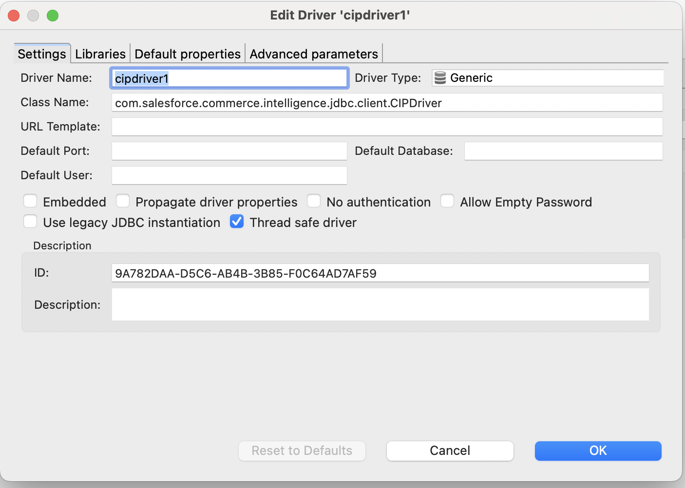
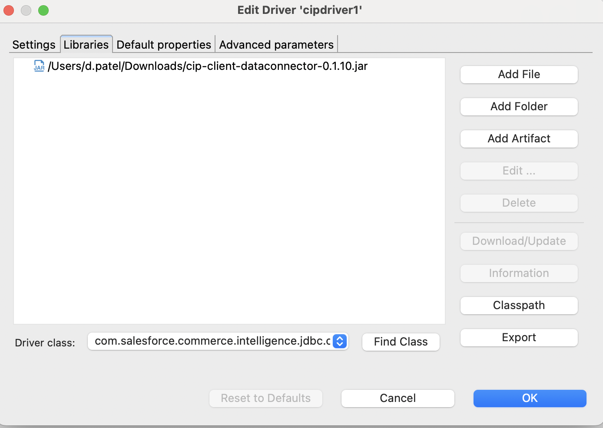

# Salesforce Commerce Intelligence JDBC Driver

The Salesforce commerce intelligence JDBC driver allows you to connect to your CIP data warehouse using a JDBC interface, providing seamless integration with various SQL editors and tools.

## Installation

To install the JDBC driver, follow these steps:

**Download**
   ```bash
   git clone https://github.com/forcedotcom/salesforce-commerce-intelligence-jdbc.git
   cd salesforce-commerce-intelligence-jdbc
   ```
   Download `cip-client-dataconnector-0.1.9.jar` file.

## Usage

After downloading the JAR file, you can install it in your SQL editor of choice. The JDBC driver exposes three main properties that you need to configure for connecting to your data sources:

**Registering the JDBC Driver in DBeaver**
Assuming you are using DBeaver, follow these steps to register the driver:

1. Open DBeaver
2. Go to Database -> Driver Manager.
3. Click on New and enter the Driver name and then Driver Class as ```com.salesforce.commerce.intelligence.jdbc.client.CIPDriver```.



Navigate to the Libraries tab and click on Add File. Choose the location of the CIP Driver JAR file you built earlier. Click on Find driver.



Click on OK.

Now, Navigate to Database -> New Database Connection. Click the driver you registered in the step above and Click on Next.

### Properties

1. **JDBC URL**
    - **Description**: Specifies the CIP database connection string, including the instance you want to connect to.
    - **Type**: String
    - **Required**: Yes
    - **Example**: `jdbc:salesforcecc://localhost:9787/xxxx_prd`

2. **Username**
    - **Description**: The Client ID provided by the Account Manager.
    - **Type**: String
    - **Required**: Yes

3. **Password**
    - **Description**: The Client Secret provided by the Account Manager.
    - **Type**: String
    - **Required**: Yes


### Connecting to the Database

In your SQL editor, use the JDBC URL format and provide the necessary credentials to establish a connection. The driver handles the authentication and connection setup using the provided properties.

By following these steps and configurations, you should be able to connect to CIP data warehouse seamlessly.
